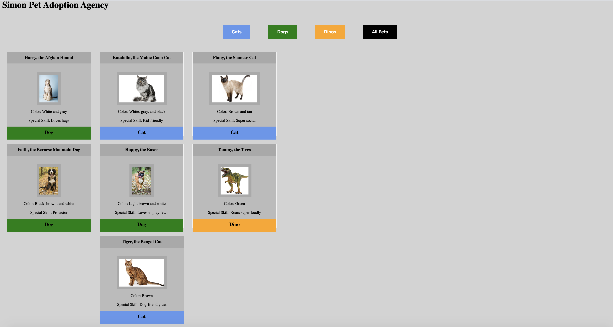

# Pet-adoption & Arrays

## Description
This project is an exploration into using a `for` loop to dynamically print a list of items and their details to the screen. This project also introduces the ability to filter the available pets by pet type and then also undo the filter to see all pets via event listeners. 

## Screenshots
##### Home Page

## How to Run
1. Clone down this repo.
1. Make sure you have http-server installed via npm. If not, get it [here](https://www.npmjs.com/package/http-server).
1. On your command line, run `hs -p 9999`.
1. In your browser, navigate to `http://localhost:9999`.